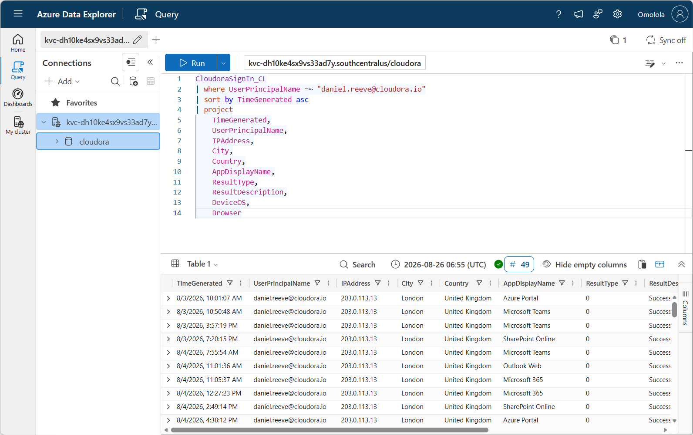
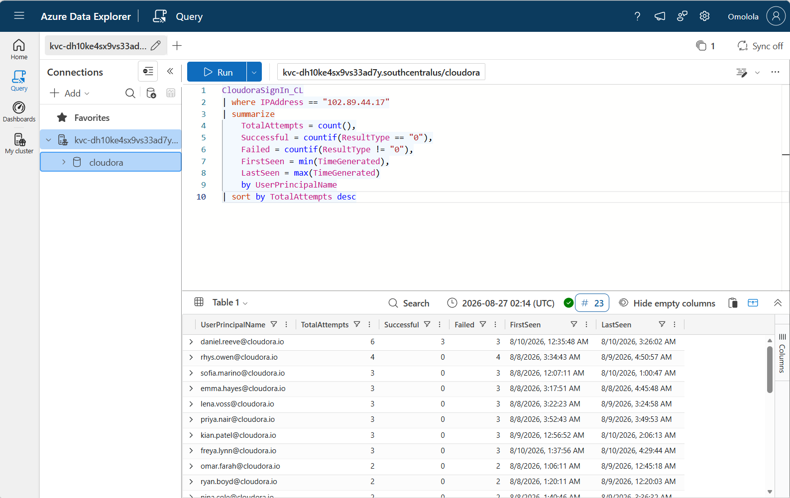
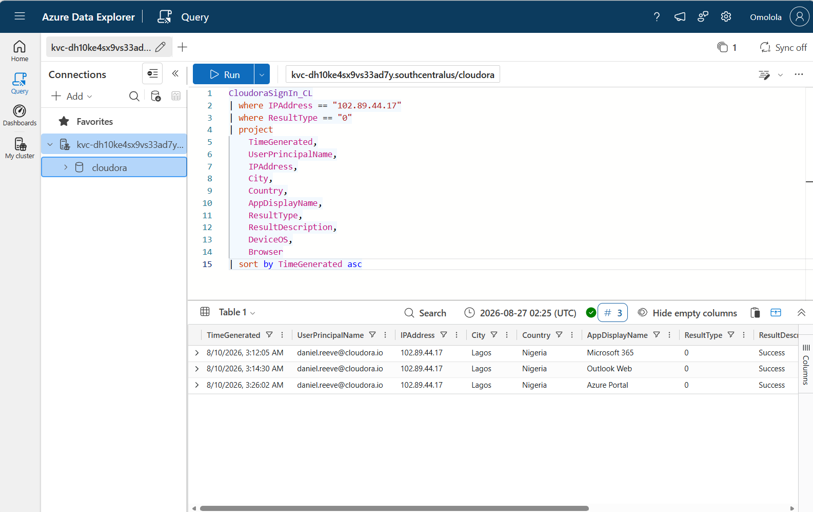
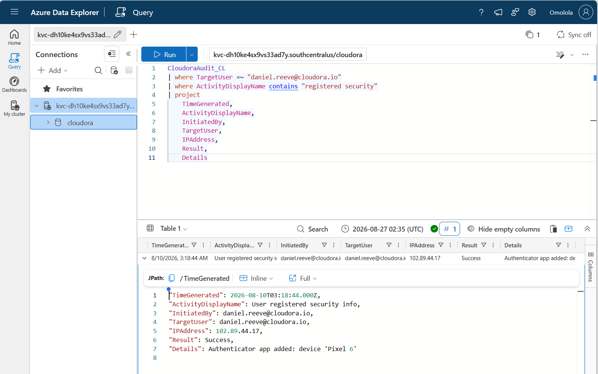
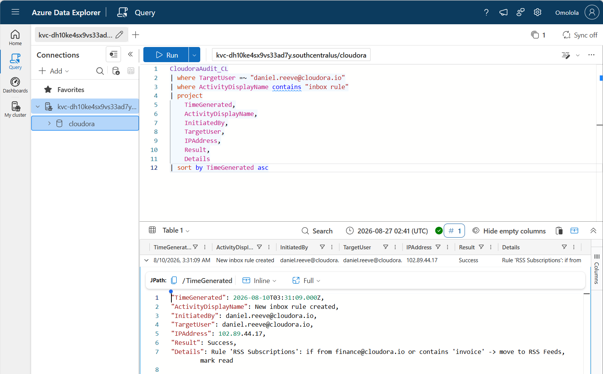
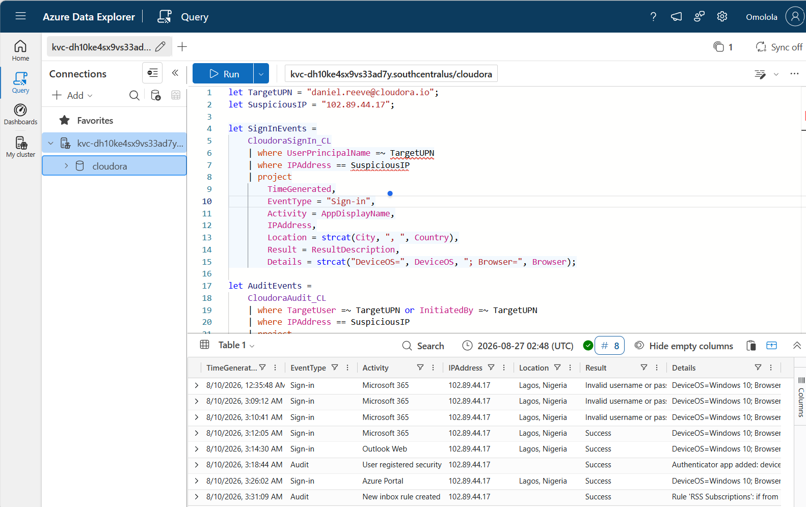
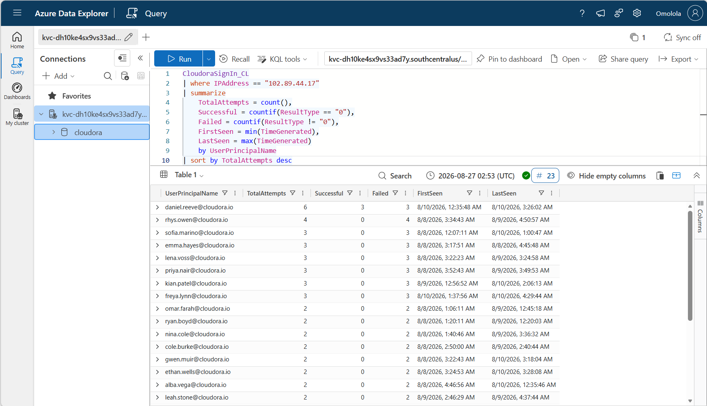
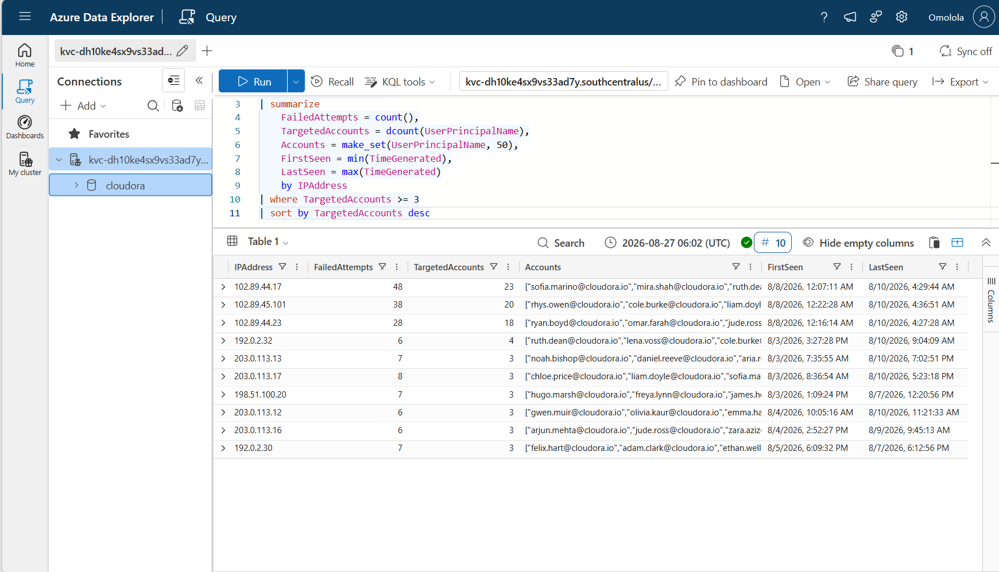

# 🔐 CEO Account Takeover Investigation — Cloudora

> Tier 1 SOC investigation of a suspected executive account takeover using Microsoft Sentinel / Azure Data Explorer, KQL, authentication telemetry, audit logs, incident response methodology, and MITRE ATT&CK mapping.

---

## 📌 Incident Overview

| Field | Details |
|---|---|
| Incident ID | CLD-0001 |
| Organization | Cloudora |
| Incident Type | Executive Account Takeover |
| Severity | P1 — Critical |
| Target Account | `daniel.reeve@cloudora.io` |
| Suspicious IP | `102.89.44.17` |
| Suspicious Location | Lagos, Nigeria |
| Investigation Platform | Azure Data Explorer |
| Query Language | Kusto Query Language (KQL) |
| Status | Confirmed Compromise |

---

## 🚨 Executive Summary

Cloudora identified suspicious authentication activity involving the CEO account `daniel.reeve@cloudora.io`.

Investigation of sign-in and audit telemetry identified authentication attempts originating from `102.89.44.17` in Lagos, Nigeria. The activity progressed from failed authentication attempts to successful access to Microsoft 365, Outlook Web, and Azure Portal.

Following successful authentication, an additional Authenticator method associated with a `Pixel 6` device was registered. A suspicious Outlook inbox rule named `RSS Subscriptions` was subsequently created to move finance-related messages to RSS Feeds and mark them as read.

Analysis of the suspicious IP also identified authentication attempts against multiple Cloudora accounts, indicating broader credential-targeting activity.

The available evidence confirms compromise of Daniel Reeve's account and demonstrates post-compromise persistence and mailbox manipulation.

The available telemetry does not independently establish that email contents were successfully collected or exfiltrated. Other accounts observed in the broader failed-authentication activity require additional investigation before compromise can be asserted.
***

# 🔎 Investigation Methodology

The investigation followed a structured SOC workflow:

1. Establish normal sign-in behavior for the executive account.
2. Identify anomalous authentication locations and IP addresses.
3. Determine whether suspicious authentication attempts succeeded.
4. Analyze audit activity following successful access.
5. Investigate persistence mechanisms.
6. Determine the scope and blast radius of the suspicious IP.
7. Build a unified chronological incident timeline.
8. Map observed behavior to MITRE ATT&CK.
9. Document indicators of compromise.
10. Develop containment and remediation recommendations.

---

# 1️⃣ Baseline Sign-In Analysis

Historical sign-in activity was reviewed to establish normal behavior for Daniel Reeve.

The account primarily demonstrated successful authentication activity associated with London, United Kingdom.



This baseline provided context for identifying subsequent authentication from Lagos, Nigeria as anomalous.

---

# 2️⃣ Suspicious IP Scope Analysis

Investigation identified the suspicious source IP:

`102.89.44.17`

The IP generated authentication attempts against multiple Cloudora user accounts.



This behavior indicates that the activity was broader than an isolated login attempt against the CEO.

---

# 3️⃣ Successful Authentication from Lagos

The investigation confirmed successful authentication to Daniel Reeve's account from:

- **IP:** `102.89.44.17`
- **Location:** Lagos, Nigeria

Successful access included:

- Microsoft 365
- Outlook Web
- Azure Portal



The successful authentications established that the suspicious actor obtained functional access to the executive account.

---

# 4️⃣ Persistence — Authenticator Registration

Audit telemetry showed that a new authentication method was registered after the suspicious login.

The event occurred at approximately:

`2026-08-10 03:18:44 UTC`

The audit details identified:

`Authenticator app added: device 'Pixel 6'`



Registering an additional authentication method after account compromise can provide continued access even if the original credentials are changed.

---

# 5️⃣ Mailbox Manipulation — Suspicious Inbox Rule

At approximately:

`2026-08-10 03:31:09 UTC`

a new inbox rule named:

`RSS Subscriptions`

was successfully created.

The rule targeted messages:

- originating from `finance@cloudora.io`
- or containing the word `invoice`

Matching messages were configured to:

- move to **RSS Feeds**
- be **marked as read**



This behavior is consistent with post-compromise mailbox manipulation designed to reduce the visibility of financially sensitive communications.

---

# 🕒 Unified Incident Timeline

Sign-in and audit telemetry were combined to reconstruct the attack chronologically.


Detailed timeline artifact: [`timeline/incident-timeline.md`](timeline/incident-timeline.md)
### Attack Progression

| Time (UTC) | Event |
|---|---|
| 00:35:48 | Failed Microsoft 365 authentication |
| 03:09:12 | Failed Microsoft 365 authentication |
| 03:10:41 | Failed Microsoft 365 authentication |
| 03:12:05 | Successful Microsoft 365 authentication |
| 03:14:30 | Successful Outlook Web access |
| 03:18:44 | New Authenticator method registered |
| 03:26:02 | Successful Azure Portal access |
| 03:31:09 | Suspicious inbox rule created |

The sequence demonstrates progression from unsuccessful authentication attempts to successful account access and post-compromise activity.

---

# 🌐 Blast Radius Analysis

The suspicious IP was evaluated across Cloudora's sign-in telemetry.



Daniel Reeve's account recorded:

- **6 total attempts**
- **3 successful**
- **3 failed**

Numerous additional Cloudora accounts received failed authentication attempts from the same IP.

This indicates broader credential-targeting activity; however, the available telemetry shown in this investigation confirms successful compromise only for Daniel Reeve's account.

---

# 🎯 Indicators of Compromise

| Indicator | Value |
|---|---|
| Compromised Account | `daniel.reeve@cloudora.io` |
| Suspicious IP | `102.89.44.17` |
| Suspicious Location | Lagos, Nigeria |
| Unauthorized Device | `Pixel 6` |
| Malicious/Suspicious Inbox Rule | `RSS Subscriptions` |
| Targeted Mail Content | Finance / Invoice-related messages |

Additional IOC documentation is available in:

`evidence/indicators-of-compromise.md`

---

# 🧭 MITRE ATT&CK Mapping

| Technique | Technique ID | Evidence |
|---|---|---|
| Valid Accounts | T1078 | Successful access using Daniel Reeve's account |
| Account Manipulation | T1098 | Additional Authenticator method registered after compromise |

The mapping is based on behavior directly supported by the available telemetry. Attacker intent beyond the observed evidence is not asserted.

See:

`mitre-attack/mitre-attack-mapping.md`

---

# 🛡️ Containment and Remediation

Recommended immediate response actions include:

1. Reset the compromised account password.
2. Revoke active sessions and authentication tokens.
3. Remove the unauthorized Authenticator registration.
4. Remove the suspicious `RSS Subscriptions` inbox rule.
5. Investigate or block `102.89.44.17` across relevant security controls.
6. Review mailbox activity for unauthorized access to sensitive communications.
7. Review Azure Portal activity for unauthorized administrative changes.
8. Investigate all accounts targeted by the suspicious IP.
9. Review authentication telemetry for related infrastructure and anomalous locations.
10. Increase monitoring of executive and privileged accounts.

Longer-term improvements should include phishing-resistant MFA, alerts for authentication-method registration, alerts for suspicious inbox-rule creation, impossible-travel/anomalous-location monitoring, stronger Conditional Access policies, and enhanced monitoring of executive accounts.

---

# 💻 KQL Investigation Queries

The project contains reusable KQL queries covering each investigation phase:

| Query | Purpose |
|---|---|
| `01-baseline-signin-analysis.kql` | Establish normal authentication behavior |
| `02-ceo-suspicious-signin.kql` | Investigate suspicious CEO authentication |
| `03-ip-location-analysis.kql` | Analyze suspicious IP and location |
| `04-audit-activity-analysis.kql` | Investigate post-authentication audit activity |
| `05-persistence-investigation.kql` | Identify persistence mechanisms |
| `06-scope-analysis.kql` | Determine affected-account scope |
| `07-incident-timeline.kql` | Reconstruct unified incident timeline |

All queries are stored in:

`kql/`

---

# 📁 Repository Structure

```text
01-CEO-Account-Takeover-Investigation/
├── evidence/
│   └── indicators-of-compromise.md
├── kql/
│   ├── 01-baseline-signin-analysis.kql
│   ├── 02-ceo-suspicious-signin.kql
│   ├── 03-ip-location-analysis.kql
│   ├── 04-audit-activity-analysis.kql
│   ├── 05-persistence-investigation.kql
│   ├── 06-scope-analysis.kql
│   └── 07-incident-timeline.kql
├── mitre-attack/
│   └── mitre-attack-mapping.md
├── reports/
│   └── incident-report.md
├── screenshots/
│   ├── persistence/
│   ├── scope/
│   ├── signin/
│   └── timeline/
└── README.md
```

---

# 🧠 Skills Demonstrated

This project demonstrates practical experience with:

- Security Operations Center (SOC) investigation
- Microsoft cloud authentication analysis
- Azure Data Explorer
- Kusto Query Language (KQL)
- Sign-in log analysis
- Audit log analysis
- Account takeover investigation
- Identity threat investigation
- Persistence identification
- Mailbox-rule investigation
- Scope and blast-radius analysis
- Incident timeline reconstruction
- Indicator-of-compromise documentation
- MITRE ATT&CK mapping
- Incident containment and remediation
- Technical incident reporting

---

## 🚨 Detection Engineering

Following the investigation, reusable KQL detection logic was developed to identify similar account-compromise activity.

### Multi-Account Failed Authentication Detection

The detection analyzes failed authentication activity by source IP and identifies IP addresses targeting multiple user accounts.

Testing the rule against the Cloudora sign-in telemetry identified the incident IP `102.89.44.17` as the highest-volume source observed by the rule:

| Metric | Result |
|---|---:|
| Source IP | `102.89.44.17` |
| Failed Authentication Attempts | 48 |
| Distinct Targeted Accounts | 23 |



The result demonstrates that the detection can surface broad multi-account authentication activity for analyst investigation. Detection results require contextual validation and should not be treated as proof of malicious activity by themselves.

### Detection Rules

The project includes reusable KQL detections for:

- Suspicious successful executive sign-ins from unexpected locations
- Security-information / Authenticator registration
- Suspicious inbox-rule creation
- Multi-account failed-authentication activity

Detection logic is maintained in the [`detection-rules/`](detection-rules/) directory.

# 📄 Investigation Conclusion

The investigation confirms compromise of the Cloudora CEO account.

The evidence demonstrates a progression from failed authentication attempts to successful cloud authentication, Outlook Web access, unauthorized authentication-method registration, Azure Portal access, and suspicious inbox-rule creation.

The source IP also targeted multiple Cloudora accounts, indicating broader credential-targeting activity.

The strongest evidence of persistence is the additional Authenticator registration associated with a `Pixel 6`, while the suspicious inbox rule demonstrates post-compromise manipulation of the executive mailbox.

The incident should therefore be treated as a **P1 executive account compromise requiring immediate containment, credential reset, session revocation, persistence removal, mailbox review, and continued monitoring**.

No conclusion of confirmed data exfiltration is made without additional supporting telemetry.

---

## ⚠️ Disclaimer

This project is a cybersecurity lab and portfolio investigation based on simulated data. Names, accounts, infrastructure, and incident details are used for educational purposes.
